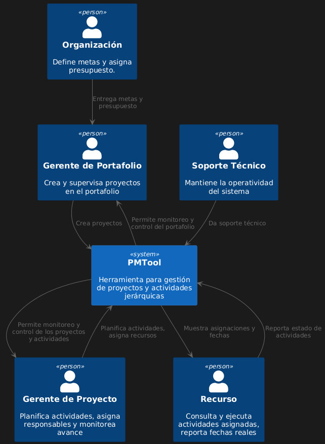
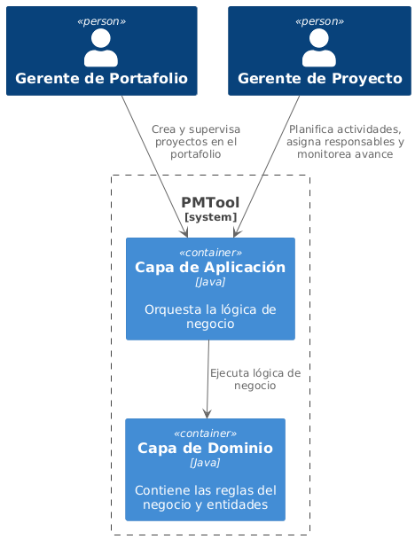
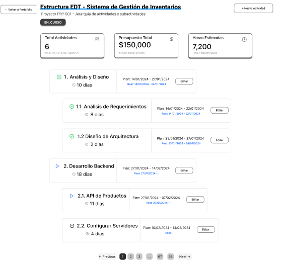
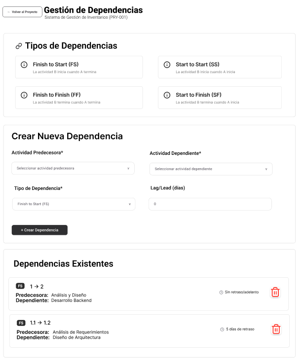

# PMTool — Project Management Engine & Software Engineering Case Study

[](https://github.com/Valentino-Carmona/PMTool/actions/workflows/build-and-test.yml)
[](https://codecov.io/gh/Valentino-Carmona/PMTool)


---

## 01. Overview

**PMTool is an object-oriented Java application for project and portfolio management**, centered on hierarchical Work Breakdown Structures (EDT / WBS), Finish-to-Start activity dependencies with lead/lag offsets, and recursive calculation of planned activity dates.

### Academic Origin

PMTool was developed iteratively across five engineering stages as part of the Software Engineering curriculum:

1. **Requirements Engineering:** reverse-engineered requirements, traceability matrix and stakeholder analysis.
2. **Domain Modeling:** Domain Storytelling and domain process modeling.
3. **User Stories & BDD:** Gherkin user stories, Cucumber scenarios and formal domain modeling.
4. **Architecture & Implementation:** layered architecture, C4 modeling, scheduling logic, automated tests and UI prototyping.
5. **Final Iteration:** relational database design, multi-project simulation and automated CI pipeline.

The project therefore covers the software engineering process from requirements analysis through domain modeling, architecture, implementation and validation.

### Implementation Scope

The implemented system is a **Java 21 application managed with Gradle**, organized in layers around an in-memory repository. It includes domain entities and value objects, project and activity management, Finish-to-Start dependencies with lead/lag, recursive date calculation, cycle validation, Cucumber BDD scenarios, unit tests and GitHub Actions CI.

The repository also contains architectural and engineering artifacts including C4 diagrams, a domain model, requirements traceability, stakeholder analysis, UI prototypes and a relational database design.

For the complete engineering documentation, see the [Integrated System Documentation](docs/documentacion.md).

---

## 02. Key Domain Capabilities

* **Hierarchical Work Breakdown Structure (EDT / WBS):** Activities can be organized into multiple hierarchical levels with automatic EDT numbering such as `1`, `1.1` and `1.1.1`.
* **Finish-to-Start Dependencies:** Activities can define a predecessor using a Finish-to-Start relationship with an optional positive or negative lead/lag offset.
* **Recursive Schedule Calculation:** Planned activity dates are calculated from the project's planned start date, taking into account activity hierarchy and Finish-to-Start dependencies.
* **Cycle Validation:** `ValidadorCiclosDependencias` validates dependency graphs and rejects cyclic dependency chains.
* **Activity Lifecycle:** Activities represent planned and actual execution information through states such as `PLANIFICADA`, `EN_EJECUCION` and `COMPLETADA`.
* **Role Separation:** The domain distinguishes responsibilities between the **Portfolio Manager** (`GerentePortafolio`) and **Project Manager** (`GerenteProyecto`).

---

## 03. Architecture

PMTool follows a **Layered Architecture** documented using the **C4 Model**.

### 3.1. C4 Model

#### Level 1 — System Context

The System Context diagram shows the two primary human actors interacting with PMTool:

* **Portfolio Manager**
* **Project Manager**



#### Level 2 — Container

The Container diagram represents the application's main architectural boundaries:



### 3.2. Layered Structure

#### Application / Entry Point — `org.pmtool.app`

`Main.java` provides the executable entry point and runs multi-project domain simulations.

#### Manager Layer — `org.pmtool.manager`

Coordinates domain operations through:

* `GerentePortafolio`
* `GerenteProyecto`

These components orchestrate project creation, project management, activity organization and scheduling operations.

#### Domain Layer — `org.pmtool.model`

Contains the core domain concepts and business rules.

* **Entities:** `Proyecto`, `Actividad`
* **Dependencies:** `IDependencia`, implemented by `FinishToStart`
* **Value Objects:** `NumeroEDT`, `Duracion`

#### Validation Layer — `org.pmtool.validation`

Contains domain validations such as dependency cycle detection.

#### Repository Layer — `org.pmtool.repository`

Defines the `ProyectoRepository` abstraction and its in-memory implementation `InMemoryProyectoRepository`.

### 3.3. Domain Model

The main domain concepts and their relationships are documented through the project's Model of the Domain (MDD):


---

## 04. Engineering & Design

### 4.1. Recursive Scheduling

The scheduling logic calculates planned dates recursively.

For activities with subactivities, the parent's planned dates are derived from the dates of its children.

For leaf activities:

* Without a predecessor, the activity starts from the project's planned start date.
* With a Finish-to-Start dependency, the start date is calculated from the predecessor's planned finish and the associated lead/lag value.
* The planned finish date is then derived from the activity duration.

The implementation is centered around `Actividad.calcularFechasPlanificadas(...)`.

### 4.2. Dependency Cycle Detection

Before establishing dependencies, `ValidadorCiclosDependencias` validates the directed dependency graph and prevents cyclic chains that could make scheduling impossible.

### 4.3. Relational Database Design

The repository also contains a **relational database design artifact** aligned with the domain model.

The design documents:

* `PROYECTO` and `ACTIVIDAD` entities.
* Primary and foreign keys.
* Unique constraints.
* Hierarchical activity relationships.
* Finish-to-Start predecessor relationships.
* Lead/lag information.
* Entity cardinalities.

The database is documented as a design artifact; the implemented application uses an in-memory repository.

See the complete [database design](docs/bd.md).

---

## 05. Testing & Quality Assurance

The project currently has **85 automated tests**, all passing successfully.

| Metric | Result |
| :--- | :--- |
| **Automated Tests** | **85** |
| **Failures** | **0** |
| **Ignored Tests** | **0** |
| **Success Rate** | **100%** |
| **JaCoCo Instruction Coverage** | **94%** |
| **JaCoCo Branch Coverage** | **80%** |
| **Cucumber Scenarios** | **100% passing** |

JaCoCo reports **1,811 of 1,922 instructions covered** and **97 of 120 branches covered**.

### Test Organization

* **Cucumber / BDD:** automated Gherkin scenarios covering the defined user stories and domain behavior.
* **Domain & Value Objects:** unit tests for core entities, duration validation and EDT numbering.
* **Managers:** tests for portfolio and project coordination.
* **Validation:** dedicated tests for dependency cycle detection.
* **Repository:** tests for the in-memory repository implementation.
* **Main Simulation:** execution of the application entry-point flow is exercised as part of the test/validation setup.

### Continuous Integration

GitHub Actions automates the project's build and validation workflow, including:

* Java 21 build.
* Automated tests.
* Checkstyle validation.
* JaCoCo report generation.
* Coverage publication through Codecov.

---

## 06. Engineering Documentation

The repository contains the main engineering artifacts produced throughout the project:

| Artifact | Description |
| :--- | :--- |
| [Requirements & Traceability](docs/requisitos.md) | Requirements specification and traceability matrix |
| [Stakeholder Analysis](docs/interesados.md) | Stakeholder identification and Onion Model |
| [Domain Storytelling](docs/ddd.md) | Coarse-grained domain stories |
| [Domain Model](docs/mdd.md) | Domain entities, relationships, value objects and data dictionary |
| [Architecture](docs/arquitectura.md) | C4 Context and Container diagrams |
| [UI Prototypes](docs/prototipos.md) | UI decisions and interactive Figma prototype |
| [Database Design](docs/bd.md) | Relational database / ER design |
| [Integrated Documentation](docs/documentacion.md) | Consolidated engineering documentation |

The documentation was developed iteratively across the five project stages, maintaining traceability between requirements, domain models, user stories and architectural artifacts. The requirements document and traceability matrix explicitly connect requirements with domain stories and `.feature` specifications.

---

## 07. Interactive UI Prototype

The project's interface was designed as a **Figma interactive prototype** based on the documented domain and functional scope.

The prototype includes flows for:

* Portfolio management.
* Project creation.
* EDT visualization.
* Activity management.
* Dependency configuration.

**[Open the PMTool Figma Prototype](https://www.figma.com/proto/hFTAmDw03fC3X70Vi29zVv/PMTool?node-id=4-5388&p=f&t=Ji59y6wYZXWxla7R-1&scaling=min-zoom&content-scaling=fixed&page-id=0%3A1&starting-point-node-id=4%3A5388)**

A snapshot of the prototype is preserved in `docs/prototipo.pdf`.

### UI Showcase

| Portfolio Dashboard | Project EDT Hierarchy |
| :---: | :---: |
|  |  |

| Activity & Dependency Configuration | Project Creation Modal |
| :---: | :---: |
|  |  |

---

## 08. Quick Start

### Requirements

* Java 21
* Gradle 8.x, or the included Gradle wrapper

### Run the Application

Linux / macOS:

```bash
./gradlew run --quiet
```

Windows:

```powershell
.\gradlew.bat run --quiet
```

The application executes the multi-project simulation defined in `Main.java`.

### Run Tests

```bash
./gradlew test
```

### Generate Coverage Report

```bash
./gradlew build jacocoTestReport
```

### Validate Code Style

```bash
./gradlew validate
```

Generated reports include:

* HTML test report: `app/build/reports/tests/test/index.html`
* JaCoCo report: `app/build/reports/jacoco/test/html/index.html`
* Cucumber reports: `app/build/reports/cucumber/`

---

## 09. Project Structure

```text
PMTool
├── .github/
│   └── workflows/
│       └── build-and-test.yml
├── app/
│   ├── build.gradle.kts
│   └── src/
│       ├── main/java/org/pmtool/
│       │   ├── app/
│       │   │   └── Main.java
│       │   ├── manager/
│       │   ├── model/
│       │   ├── repository/
│       │   └── validation/
│       └── test/
│           ├── java/org/pmtool/
│           └── resources/features/
├── docs/
│   ├── documentacion.md
│   ├── interesados.md
│   ├── requisitos.md
│   ├── ddd.md
│   ├── mdd.md
│   ├── arquitectura.md
│   ├── prototipos.md
│   ├── prototipo.pdf
│   ├── bd.md
│   └── img/
├── build.gradle.kts
└── settings.gradle.kts
```

---

## Author

**Valentino Carmona**

Computer Engineering Student — University of Buenos Aires (FIUBA)

[GitHub — @Valentino-Carmona](https://github.com/Valentino-Carmona)
