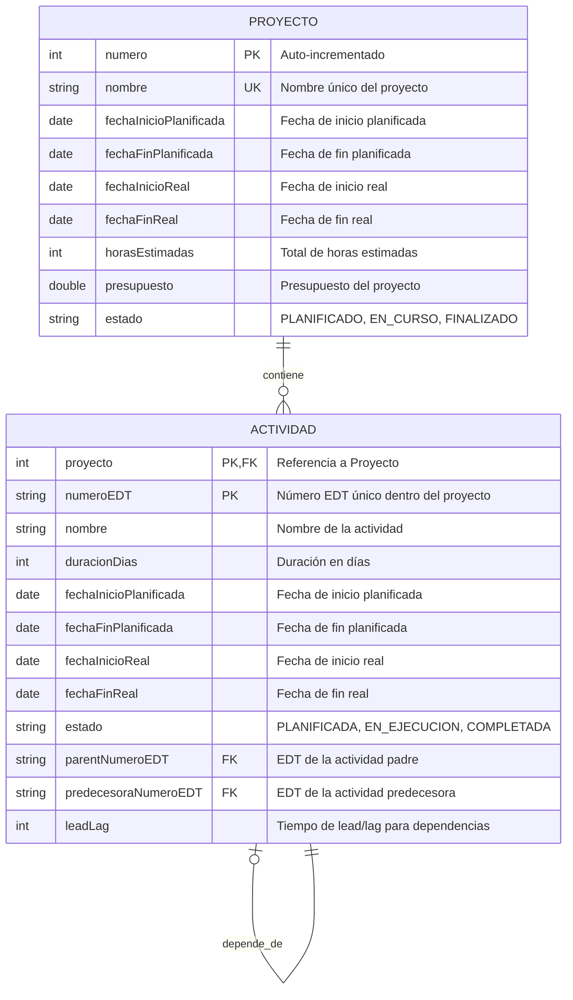

# Diseño de Base de Datos - Sistema de Gestión de Proyectos

## Diagrama Entidad-Relación

## Justificación del Diseño

### Decisiones de Diseño Principales

#### 1. Estructura de Entidades
- **PROYECTO**: Representa la entidad principal del sistema, con `numero` como clave primaria auto-incrementada y `nombre` como clave única para evitar duplicados. 
- **ACTIVIDAD**: Utiliza una clave primaria compuesta `(proyecto, numeroEDT)` para garantizar unicidad del EDT dentro de cada proyecto. Incluye atributos para jerarquía (`parentNumeroEDT`) y dependencias (`predecesoraNumeroEDT`, `leadLag`).

#### 2. Relaciones Implementadas

##### Proyecto-Actividad (1:N)
- Un proyecto contiene múltiples actividades
- Cada actividad pertenece a exactamente un proyecto
- Implementada mediante FK `proyecto` en la tabla ACTIVIDAD

##### Jerarquía de Actividades (1:N)
- Una actividad puede tener múltiples subactividades
- Cada subactividad tiene como máximo una actividad padre
- Implementada con FKs `parentNumeroEDT`
- Permite valores NULL para actividades de nivel raíz

##### Dependencias entre Actividades (N:1)
- Múltiples actividades pueden depender de una actividad predecesora
- Cada actividad tiene como máximo una dependencia directa
- Implementada con FKs `predecesoraNumeroEDT`
- Incluye `leadLag` para modelar tiempos de adelanto/retraso
- Permite valores NULL para actividades sin dependencias.

#### 3. Consideraciones de Integridad

##### Restricciones Implícitas
- Las claves foráneas compuestas aseguran integridad referencial
- Los estados están definidos como enumeraciones controladas
- Las fechas reales pueden ser NULL hasta que ocurran

#### 4. Escalabilidad y Flexibilidad

El diseño permite:
- **Jerarquías anidadas**: Actividades pueden tener múltiples niveles de subactividades
- **Dependencias complejas**: Aunque actualmente implementa finish-to-start, el campo `leadLag` permite modelar adelantos y retrasos
- **Extensibilidad**: Fácil adición de nuevos tipos de dependencias o atributos
- **Integridad**: Las claves compuestas mantienen consistencia sin requerir IDs artificiales
- **Tercera Forma Normal (3FN)**:
    - Ambas relaciones (PROYECTO y ACTIVIDAD) están en 1FN, ya que todos los atributos son atómicos y monovaluados.
    - Ambas están en 2FN, ya que no existen dependencias funcionales parciales en los atributos no clave.
    - Ambas están en 3FN, ya que no hay dependencias funcionales transitivas no triviales entre atributos no clave. Todos los atributos no clave dependen directamente de las claves primarias (numero para PROYECTO, y (proyecto, numeroEDT) para ACTIVIDAD), y no hay dependencias entre atributos no clave que violen 3FN.
