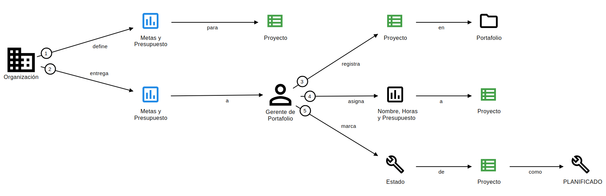
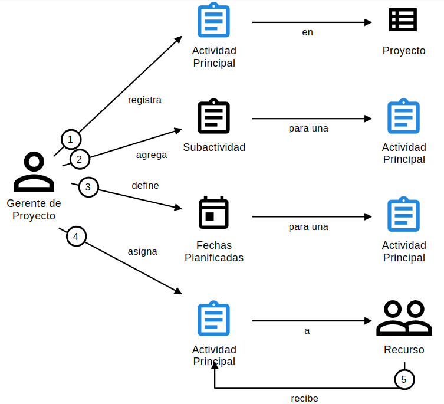
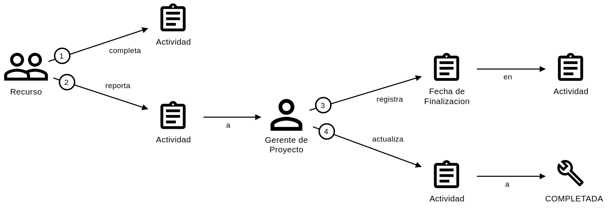

# **Historias De Dominio para PMTool**

## **Historia de Dominio 1: Creación de Proyectos en el Portafolio**

- **Código**: PMTool-001
- **Título**: Definición y Registro de Proyectos en el Portafolio
- **Subdominio**: Gestión de Portafolios
- **Descripción**: La *Organización* define metas y presupuesto para un nuevo proyecto. El *Gerente de Portafolio* registra el proyecto en el portafolio, asignándole nombre, horas estimadas y presupuesto, y lo marca como "PLANIFICADO".
- **Escenario**:
  1. La Organización aprueba un nuevo proyecto con metas específicas.
  2. El Gerente de Portafolio registra los detalles en el portafolio.
  3. El proyecto se establece en estado "PLANIFICADO".
- **Diagrama**:
  <!-- 
  1. **Organización** [define] **Metas y Presupuesto** [para Proyecto].
  2. **Organización** [entrega] **Metas y Presupuesto** [a Gerente de Portafolio].
  3. **Gerente de Portafolio** [registra] **Proyecto** [en Documento de Portafolio].
  4. **Gerente de Portafolio** [asigna] **Nombre, Horas y Presupuesto** [a Proyecto].
  5. **Gerente de Portafolio** [marca] **Estado de Proyecto** [como PLANIFICADO]. 
  -->

  

- **Anotaciones**:
  - **Suposiciones**:
    - La Organización aprueba el proyecto antes de su registro (requisitos 1.5).
    - El proyecto incluye nombre, horas estimadas y presupuesto (requisito 3.1.1).
  - **Variaciones**:
    - Si faltan metas o presupuesto, el Gerente de Portafolio no registrará un nuevo proyecto.
    - No se registran proyectos sin aprobación de la Organización.
  - **Definiciones**:
    - **Portafolio**: Conjunto de proyectos gestionados (requisito 1.1).
    - **Proyecto**: Iniciativa con nombre, horas, presupuesto y estado (requisito 2.1).
  - **Notas**:
    - El Gerente de Portafolio colabora con la Organización para alinear metas (requisito 1.1).
    - El Documento de Portafolio es un objeto de trabajo que contiene los proyectos registrados y sus detalles.

---

## **Historia de Dominio 2: Planificación y Asignación de Actividades de un Proyecto**

- **Código**: PMTool-002
- **Título**: Planificación y Asignación de Actividades
- **Subdominio**: Planificación de Proyectos
- **Descripción**: Un *Gerente de Proyecto* organiza las actividades de un proyecto en estado "PLANIFICADO", organizándolas y asignandoles Recursos, el *Recurso* recibe las asignaciones para ejecutarlas.
- **Escenario**:
  1. El proyecto está en estado "PLANIFICADO".
  2. El Gerente de Proyecto registra actividades principales y subactividades con nombres, fechas planificadas y responsables.
  3. El Recurso es informado de las actividades asignadas.
- **Diagrama**:
    <!--
    1. **Gerente de Proyecto** [registra] **Actividad Principal** [en Proyecto].
    2. **Gerente de Proyecto** [agrega] **Subactividad** [para una Actividad Principal].
    3. **Gerente de Proyecto** [define] **Fechas Planificadas** [para una Actividad].
    4. **Gerente de Proyecto** [asigna] **Actividad** [a Recurso].
    5. **Recurso** [recibe] **Asignación de Actividad**. 
    -->

  

- **Anotaciones**:
  - **Suposiciones**:
    - El proyecto está en "PLANIFICADO" (requisito 3.2.5).
    - Al registrar una actividad esta esta "PLANIFICADO" (requisito 3.2.1.1).
    - Las actividades tienen nombres y fechas válidas (requisito 3.2.4).
    - Al decidir activar una actividad, esta pasa a estar en "EN_EJECUCION" con una fecha valida (requisito 3.2.5.1.1).
  - **Variaciones**:
    - No se registran actividades en proyectos en estado "FINALIZADO".
    - Si una actividad no tiene fechas válidas, el Gerente de Proyecto la revisa antes de registrarla.
  - **Definiciones**:
    - **Actividad**: Unidad de trabajo dentro de un proyecto, con nombre, fechas y responsable asignado.
  - **Notas**:
    - La asignación refleja colaboración entre Gerente de Proyecto y Recurso (requisito 3.2.6).

---

## **Historia de Dominio 3: Finalización de Actividades**

- **Código**: PMTool-003
- **Título**: Reporte y Registro de Finalización de Actividades
- **Subdominio**: Ejecución de Proyectos
- **Descripción**: El *Recurso* y el *Gerente de Proyecto* gestionan la finalización de las actividades de un proyecto en ejecución, asegurando que queden completadas.
- **Escenario**:
  1. La actividad está en estado "EN_EJECUCION".
  2. El Recurso completa la actividad y notifica al Gerente de Proyecto.
  3. El Gerente de Proyecto registra la finalización y actualiza el estado.
- **Diagrama**:
    <!--
    1. **Recurso** [completa] **Actividad** 
    2. **Recurso** [reporta] **Actividad** [a] **Gerente de Proyecto**
    3. **Gerente de Proyecto** [registra] **Registro de Finalización** [en] **Actividad**.
    4. **Gerente de Proyecto** [actualiza] **Estado** [a] **COMPLETADA** [aplica a] **Actividad**.
    -->

  

- **Anotaciones**:
  - **Suposiciones**:
    - La actividad está en "EN_EJECUCION" (requisito 3.2.5).
    - La Fecha Real de Finalización es válida y posterior a la fecha de inicio (requisito 3.2.4).
  - **Variaciones**:
    - Si la actividad no está en "EN_EJECUCION", no se registra la finalización.
    - Si falta la fecha real, el Gerente de Proyecto no actualiza el estado a "FINALIZADO" (requisito 3.2.5.2.1).
  - **Definiciones**:
    - **Fecha Real de Finalización**: Fecha en que la actividad se completa (requisito 3.2.4).
    - **Estado**: PLANIFICADA, EN_EJECUCION, COMPLETADA (requisito 3.2.5).
  - **Notas**:
    - El reporte de finalización refleja colaboración entre Gerente de Proyecto y Recurso (requisito 3.2.6).