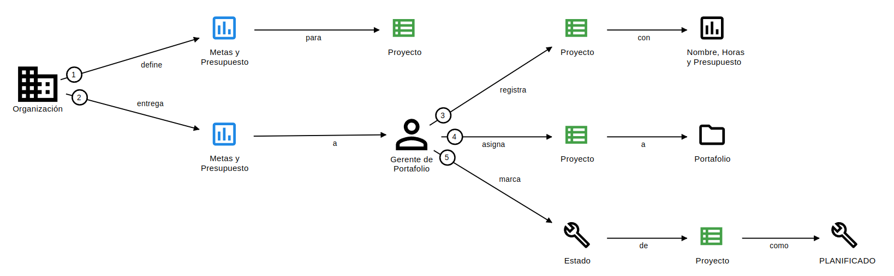
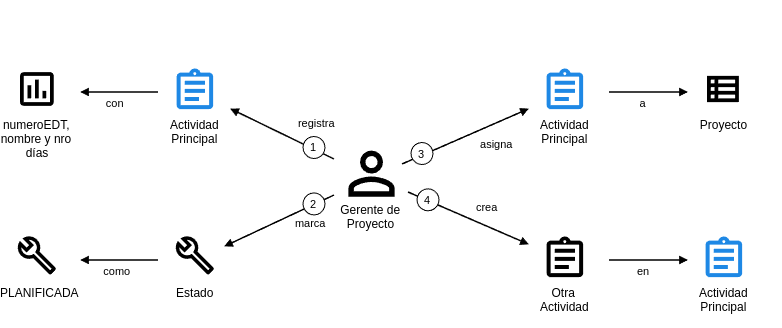
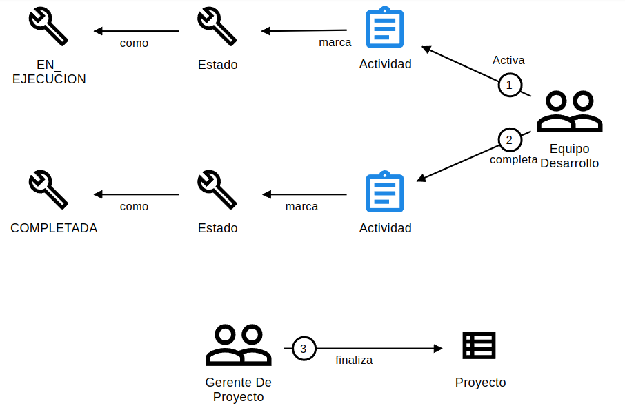

# **Historias De Dominio para PMTool**

## **Historia de Dominio 1: Creación de Proyectos en el Portafolio**

- **Código**: ddd-001
- **Título**: Definición y Registro de Proyectos en el Portafolio
- **Subdominio**: Gestión de Portafolios
- **Descripción**: La *Organización* define metas y presupuesto para un nuevo proyecto. El *Gerente de Portafolio* registra el proyecto en el portafolio, asignándole nombre, horas estimadas y presupuesto, y lo marca como "PLANIFICADO".
- **Escenario**:
  1. La Organización aprueba un nuevo proyecto con metas específicas.
  2. El Gerente de Portafolio registra los detalles en el portafolio, asegurando un nombre único y asignando un código único automáticamente.
  3. El proyecto se establece en estado "PLANIFICADO".
- **Diagrama**:

  

- **Anotaciones**:
  - **Suposiciones**:
    - La Organización aprueba el proyecto antes de su registro (requisito 1.5).
    - El proyecto incluye nombre, horas estimadas y presupuesto (requisito 3.1.1).
    - No se permiten nombres de proyectos duplicados (requisito 3.1.5).
    - Se asigna un código único automáticamente a cada proyecto (requisito 3.1.6).
  - **Variaciones**:
    - Si faltan metas o presupuesto, el Gerente de Portafolio no registrará un nuevo proyecto.
    - No se registran proyectos sin aprobación de la Organización.
  - **Definiciones**:
    - **Portafolio**: Conjunto de proyectos gestionados (requisito 1.1).
    - **Proyecto**: Iniciativa con nombre, horas, presupuesto, código único y estado (requisitos 2.1, 3.1.6).
  - **Notas**:
    - El Gerente de Portafolio colabora con la Organización para alinear metas (requisito 1.1).
    - El Documento de Portafolio es un objeto de trabajo que contiene los proyectos registrados y sus detalles.

---

## **Historia de Dominio 2: Planificación y Asignación de Actividades de un Proyecto**

- **Código**: ddd-002
- **Título**: Planificación y Asignación de Actividades
- **Subdominio**: Planificación de Proyectos
- **Descripción**: Un *Gerente de Proyecto* crea y organiza las actividades de un proyecto en estado "PLANIFICADO", definiendo su estructura jerárquica y dependencias.
- **Escenario**:
  1. El proyecto está en estado "PLANIFICADO".
  2. El Gerente de Proyecto registra actividades principales y subactividades con nombres válidos, fechas planificadas y, opcionalmente, dependencias con otras actividades.
- **Diagrama**:

  

- **Anotaciones**:
  - **Suposiciones**:
    - El proyecto está en "PLANIFICADO" (requisito 3.1.1.1).
    - Al registrar una actividad, esta se establece en estado "PLANIFICADA" (requisito 3.2.1.1).
    - Las actividades tienen nombres válidos y fechas planificadas (requisitos 3.2.4, 3.2.8).
  - **Variaciones**:
    - No se registran actividades en proyectos en estado "FINALIZADO" (requisito 3.2.7).
    - No se crean actividades o subactividades sin un nombre válido (requisito 3.2.8).
  - **Definiciones**:
    - **Actividad**: Unidad de trabajo dentro de un proyecto, con nombre, fechas planificadas, estado y opcionalmente dependencias (requisitos 3.2.1, 3.2.6).
    - **EDT**: Estructura jerárquica de desglose de trabajo que organiza actividades y subactividades (requisito 1.2).
  - **Notas**:
    - El Gerente de Proyecto define la estructura EDT para reflejar la relación entre actividades (requisito 2.3).
    - Las fechas planificadas se actualizan automáticamente según dependencias (requisito 3.2.6.1).

---

## **Historia de Dominio 3: Finalización de Actividades y Proyecto**

- **Código**: ddd-003
- **Título**: Reporte y Registro de Finalización de Actividades y Proyecto
- **Subdominio**: Ejecución de Proyectos
- **Descripción**: Se registra la finalización de las actividades de un proyecto en ejecución, asegurando que queden completadas con fechas reales válidas. Luego de que todas las actividades finalicen, el *Gerente de Proyecto* finalizara el proyecto
- **Escenario**:
  1. La actividad está en estado "EN_EJECUCION".
  2. Se registra la finalización de la actividad, lo que la marca como "COMPLETADA".
  3. El Gerente de Proyecto registra la finalización de todas las actividades, actualizando el estado a "FINALIZADO" del proyecto.
- **Diagrama**:

  

- **Anotaciones**:
  - **Suposiciones**:
    - La actividad está en "EN_EJECUCION" (requisito 3.2.5).
    - Al completar una actividad, se registra automáticamente la fecha real de finalización (requisito 3.2.5.2.1).
  - **Variaciones**:
    - Si la actividad no está en "EN_EJECUCION", no se registra la finalización (requisito 3.2.5.2).
  - **Definiciones**:
    - **Estado**: PLANIFICADA, EN_EJECUCION, COMPLETADA (requisito 3.2.5).
  - **Notas**:
    - La finalización de actividades contribuye a la finalización del proyecto (requisito 3.1.4).