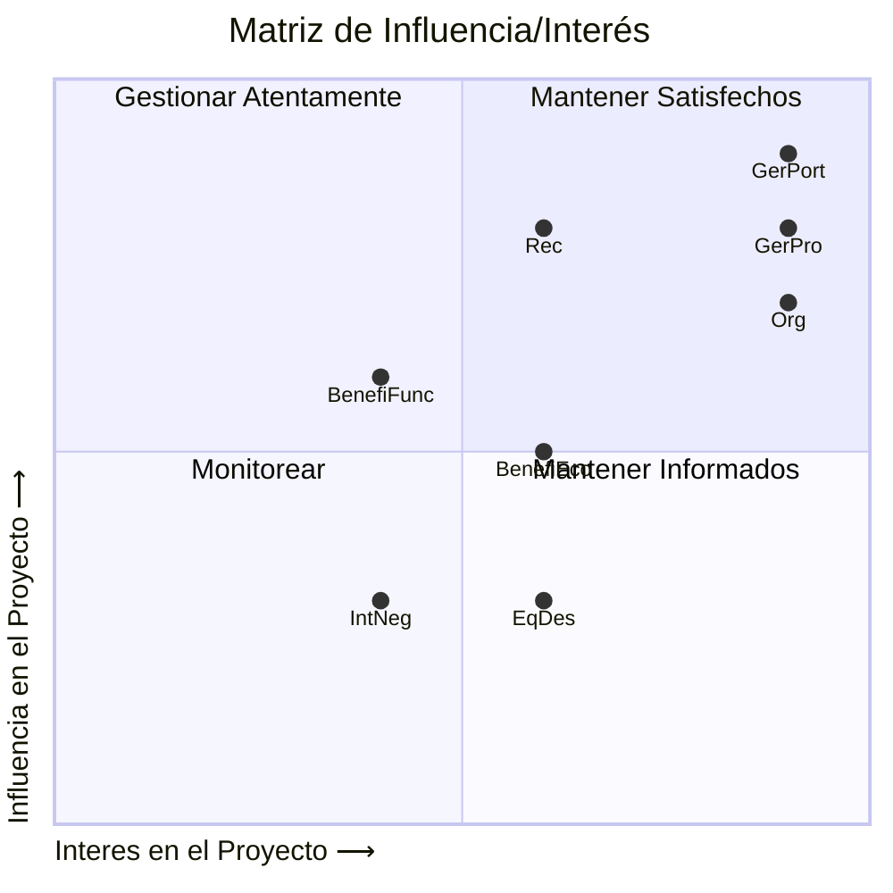
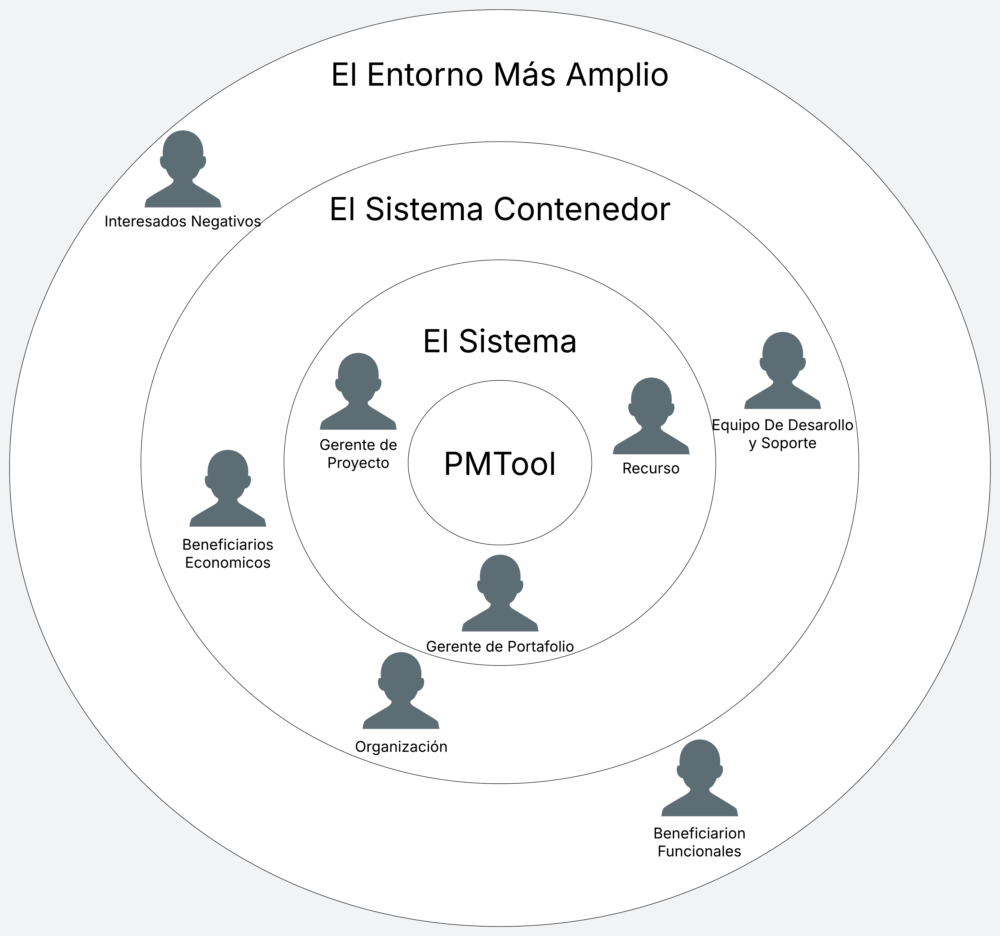

# Análisis de Interesados (Stakeholders) para PMTool

## Identificación y Descripción Detallada de Interesados

### Interesados

Los interesados (stakeholders) de PMTool han sido identificados basándose en los requisitos funcionales y de negocio detallados en `requisitos.md`, complementados con supuestos lógicos para roles contextuales:

1. **Gerente de Portafolio**  
   - **Descripción**: Supervisa el portafolio de proyectos, crea nuevos proyectos y asegura alineación estratégica. Gestiona métricas como presupuesto y plazos.  
   - **Origen**: Requisito 1.1, 2.1, 5.1.  
   - **Rol en PMTool**: Usa el sistema para iniciar proyectos y monitorear el portafolio.  

2. **Gerente de Proyecto**  
   - **Descripción**: Administra proyectos individuales, planifica actividades, asigna recursos y asegura cumplimiento de alcance, tiempo y presupuesto.  
   - **Origen**: Requisitos 2.2, 2.3, 2.5, 2.6, 3.1, 3.2.  
   - **Rol en PMTool**: Planifica y ejecuta proyectos, gestiona EDT y estados de actividades.   

3. **Recurso**  
   - **Descripción**: Miembros del equipo o contratistas asignados a actividades específicas.  
   - **Origen**: Requisito 3.2.6. Los requisitos 3.2.1–3.2.9 implican ejecución por recursos.  
   - **Rol en PMTool**: Responsable de actividades

4. **Organización**  
   - **Descripción**: Entidad que adopta PMTool, establece objetivos estratégicos, asigna presupuestos y se beneficia de los proyectos.  
   - **Origen**: Requisitos 1.1, 1.5, 5.1. Implica una entidad que financia y evalúa resultados.  
   - **Rol en PMTool**: Define metas, provee recursos y espera informes de desempeño.  

5. **Equipo de Desarrollo**  
   - **Descripción**: Equipo que construyó PMTool y podría mantener o actualizar su código.  
   - **Origen**: Requisito 4.1.
   - **Rol en PMTool**: Responsable de la creación técnica y posibles mejoras.  
    
   5.1 **Soporte**:  
      - **Descripción**: Equipo técnico que mantiene PMTool, resuelve problemas y asegura su operatividad.  
      - **Rol en PMTool**: Asegura estabilidad del sistema y resuelve incidencias para usuarios.  

6. **Beneficiarios Económicos**  
   - **Descripción**: Stakeholders que obtienen beneficios financieros del éxito de los proyectos, como ejecutivos o accionistas.  
   - **Origen**: Requisito 1.5 y 1.1 sugieren interés en eficiencia financiera.  
   - **Rol en PMTool**: Se benefician directamente de proyectos completados dentro del presupuesto.  

8. **Interesados Negativos**  
   - **Descripción**: Individuos o grupos que se podrían resistir a PMTool.  
   - **Origen**: No hay requisitos explícitos, pero el cambio a PMTool (1.1–5.3) podría generar resistencia. 
   - **Rol en PMTool**: Podrían obstaculizar la adopción o venta de los servicios de gestión de portafolios de proyectos.  

9. **Beneficiarios Funcionales**  
   - **Descripción**: Grupos que se benefician indirectamente de los resultados de los proyectos.
   - **Origen**: Requisitos 3.1.4 y 1.1 sugieren que los proyectos generan valor para otros.  
   - **Rol en PMTool**: Reciben beneficios de los entregables, pueden ser clientes que contratan los servicios de PMTool de gestión de portafolios de proyectos.  

## Matriz de Influencia/Interés

La matriz clasifica a los interesados según su influencia (capacidad de afectar PMTool) e interés (impacto del sistema en sus objetivos). Las posiciones se basan en requisitos y supuestos claros para cumplir con la retroalimentación del profesor.

### Supuestos para la Matriz :

**Gerente de Portafolio** : Alta influencia (crea proyectos, 2.1) y alto interés (éxito del portafolio, 1.1).
**Gerente de Proyecto** : Alta influencia (gestiona proyectos, 2.2–2.6) y alto interés (usuario diario de PMTool).
**Recurso** : Influencia moderada (ejecuta tareas, 3.2.6) y alto interés (depende de claridad en asignaciones).
**Organización** : Alta influencia (financia PMTool, 1.5) e interés moderado (enfocada en resultados estratégicos).
**Beneficiarios Económicos** : Influencia moderada (presión financiera, 1.5) y moderado interés (beneficios directos).
**Equipo de Desarrollo** : Muy baja influencia (4.1) y moderado interés.
**Interesados ​​Negativos** : Baja influencia e interés (resistencia al cambio).
**Beneficiarios Funcionales** : moderada influencia (sin interacción directa) e interés bajo (valoran entregables, 3.1.4).

## Diagrama de Stakeholders

### Capas del Modelo y Actores

#### Capa 0: PMTool:
   - Descripción : Sistema para gestionar portafolios, proyectos y actividades mediante una estructura de desarrollo de trabajo (EDT/WBS).
   - Rol : Habilita funcionalidades como creación de proyectos (3.1.1), gestión de actividades (3.2.1–3.2.9), y control presupuestal (1.5).

#### Capa 1: El Sistema:
   - Descripción : Usuarios directos que interactúan con PMTool para operar portafolios, proyectos y actividades.
   - Actores :
      - Gerente de Portafolio : Crea y supervisa proyectos (2.1, 1.1).
      - Gerente de Proyecto : Planifica, ejecuta y finaliza proyectos, gestiona EDT (2.2–2.6, 3.1–3.2).
      - Recurso : Ejecuta actividades asignadas y actualiza estados (3.2.6).

#### Capa 2: El Sistema Contenedor:
   - Descripción : Entidades que proveen contexto, recursos o soporte para PMTool, pero no lo usan directamente.
   - Actores :
      - Organización : Finanzas PMTool y define metas estratégicas (1.1, 1.5, 5.1).
      - Beneficiarios Económicos : Ganan con la eficiencia financiera de los proyectos (1.5).
      - Equipo de Desarrollo : Desarrolladores de PMTool.
         - Soporte : Mantiene la operatividad del sistema (4.1).

#### Capa 3: El Entorno mas amplio:
   - Descripción : Stakeholders externos con impacto indirecto en PMTool o afectados por sus resultados.
   - Actores :
      - Interesados ​​Negativos : Empleados o usuarios de sistemas anteriores que podrían oponerse.
      - Beneficiarios Funcionales : Grupos que usan los entregables de los proyectos (3.1).