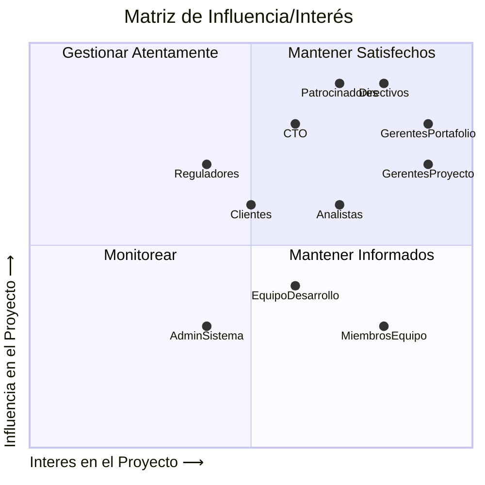
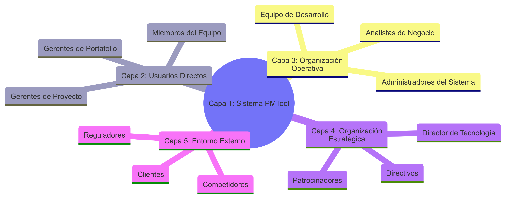

# Análisis de Interesados (Stakeholders) para PMTool

## Identificación y Descripción Detallada de Interesados

### Interesados

| Interesado | Descripción | Rol e Influencia |
|------------|-------------|------------------|
| Equipo de Desarrollo | Programadores, arquitectos y testers responsables de la implementación técnica de PMTool. | Responsables de convertir los requisitos en código funcional. Alta influencia en aspectos técnicos y baja en decisiones de negocio. |
| Administradores del Sistema | Personal encargado de la instalación, configuración y mantenimiento del sistema. | Garantizan la disponibilidad y rendimiento óptimo de la aplicación. Influencia media en aspectos técnicos y de seguridad. |
| Analistas de Negocio | Profesionales que analizan y documentan los requisitos del sistema. | Traducen necesidades de negocio en requisitos funcionales. Alta influencia en la definición de funcionalidades. |
| Director de Tecnología (CTO) | Responsable de las decisiones técnicas estratégicas. | Supervisa la arquitectura general y aprueba decisiones técnicas importantes. Alta influencia en decisiones tecnológicas. |
| Gerentes de Portafolio | Profesionales encargados de supervisar múltiples proyectos y sus relaciones. | Usuarios primarios para la creación y gestión de portafolios de proyectos. Alta influencia en requisitos relacionados con la visión global de proyectos. |
| Gerentes de Proyecto | Responsables de la planificación, ejecución y seguimiento de proyectos individuales. | Usuarios principales que utilizarán la herramienta diariamente para planificar actividades, asignar recursos y hacer seguimiento. Alta influencia en requisitos de gestión de proyectos. |
| Miembros del Equipo | Personal que ejecuta las actividades asignadas dentro de los proyectos. | Usuarios que reportan avances y actualizan estados de actividades. Influencia media en requisitos relacionados con la usabilidad y reportes de avance. |
| Directivos | Altos ejecutivos que supervisan la gestión de proyectos a nivel organizacional. | Requieren informes y visibilidad del estado general de proyectos. Alta influencia en requisitos relacionados con reportes ejecutivos. |
| Clientes | Receptores de los entregables generados por los proyectos gestionados en PMTool. | Interesados en la calidad y puntualidad de los entregables. Influencia indirecta pero significativa en requisitos. |
| Patrocinadores | Entidades que financian los proyectos y esperan retorno de inversión. | Proporcionan recursos financieros y esperan transparencia en la gestión. Alta influencia en requisitos relacionados con presupuestos y reportes financieros. |
| Reguladores | Entidades que establecen normativas aplicables a los proyectos. | Definen marcos regulatorios que el sistema debe contemplar. Influencia significativa en requisitos de cumplimiento. |

## Matriz de Influencia/Interés

## Estrategias de Gestión de Interesados

- **Gestionar Atentamente (Alta Influencia/Alto Interés)**: Directivos, Patrocinadores, Gerentes de Portafolio y Proyecto - Comunicación frecuente y participación activa en decisiones clave.

- **Mantener Satisfechos (Alta Influencia/Bajo Interés)**: CTO, Reguladores - Proporcionar información relevante y consultar en decisiones importantes.

- **Mantener Informados (Bajo Influencia/Alto Interés)**: Miembros del Equipo, Analistas - Comunicación regular sobre el progreso y cambios.

- **Monitorear (Baja Influencia/Bajo Interés)**: Administradores del Sistema - Seguimiento periódico sin comunicación excesiva.

## Diagrama de Stakeholders

## Capas del Modelo y Actores

### Capa 1: El Sistema PMTool

- **Actores:** El propio sistema PMTool
- **Tipo:** Centro del modelo

### Capa 2: Usuarios Directos

- **Actores:** Gerentes de Proyecto, Gerentes de Portafolio, Miembros del Equipo
- **Tipo:** Usuarios primarios que interactúan directamente con el sistema
- **Descripción:** Utilizan el sistema diariamente para la gestión de proyectos, creación de actividades, seguimiento de avances y actualización de estados.

### Capa 3: Organización Operativa

- **Actores:** Equipo de Desarrollo, Administradores del Sistema, Analistas de Negocio
- **Tipo:** Responsables del desarrollo, mantenimiento y mejora del sistema
- **Descripción:** Construyen, mantienen y evolucionan el sistema según las necesidades de los usuarios directos y las directrices estratégicas.

### Capa 4: Organización Estratégica

- **Actores:** Directivos, Director de Tecnología (CTO), Patrocinadores
- **Tipo:** Definen la dirección estratégica y proporcionan los recursos
- **Descripción:** Toman decisiones de alto nivel sobre inversión, alcance y prioridades del sistema, así como la alineación con los objetivos organizacionales.

### Capa 5: Entorno Externo

- **Actores:** Clientes, Reguladores, Competidores
- **Tipo:** Influyen externamente o son afectados por los resultados
- **Descripción:** Reciben los productos finales de los proyectos gestionados, establecen normativas o compiten en el mismo espacio.

## Tabla Resumen de Actores

| Capa | Parte del Sistema | Beneficiarios | Proveedores | Perjudicados |
|------|-------------------|---------------|-------------|--------------|
| Capa 1: El Sistema PMTool | ✅ | | | |
| Capa 2: Usuarios Directos | ✅ | ✅ | | |
| Capa 3: Organización Operativa | ✅ | | ✅ | |
| Capa 4: Organización Estratégica | | ✅ | ✅ | |
| Capa 5: Entorno Externo | | ✅ | | ✅ |
