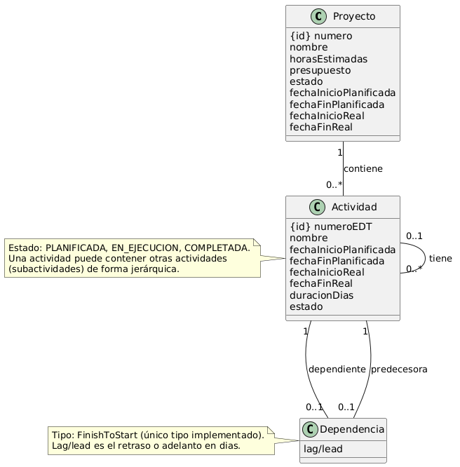
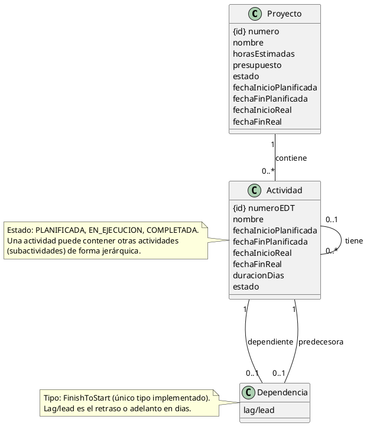

# Modelo de Dominio de PMTool

Este documento presenta el modelo de dominio de PMTool, que describe las principales entidades, atributos y relaciones del sistema. El modelo se ha desarrollado incluyendo la gestión de proyectos, actividades y dependencias entre actividades.

## Diagrama del Modelo de Dominio

El siguiente diagrama está en PlantUML y representa las entidades, sus atributos y las relaciones entre ellas.

### Notas Explicativas

- **Proyecto**: Representa un proyecto individual dentro de un portafolio, con atributos que soportan la gestión de proyectos según los requisitos 3.1.1, 3.1.2, 3.1.1.1. Cada proyecto tiene un número único automáticamente asignado (3.1.6), y su estado puede ser PLANIFICADO, EN_CURSO o FINALIZADO (3.1.1.1, 3.1.2, 3.1.3, 3.1.4). Las fechas de inicio y fin planificadas y reales son cruciales para el control del proyecto (3.1.2, 1.4).
- **Actividad**: Representa las tareas y subactividades dentro de un proyecto, organizadas jerárquicamente a través de la relación reflexiva "Actividad "0..*" -- "0..1" Actividad : tiene", lo que significa que una actividad puede tener cero o más subactividades, y cada subactividad tiene a lo sumo una actividad padre. Esto cumple con los requisitos 3.2.2, 3.2.3 y 3.2.2.1. Los atributos incluyen numeroEDT para la jerarquía (3.2.2.1), nombre (3.2.1), fechaInicioPlanificada y fechaFinPlanificada (3.2.4), fechaInicioReal y fechaFinReal (3.2.5.1.1, 3.2.5.2.1), horasEstimadas (3.2.1), estado (3.2.5), y responsable (3.2.6).
- **Dependencia**: Modela las relaciones de precedencia entre actividades, requisito 3.2.6, implementando únicamente el tipo de dependencia Finish-to-Start (FS) con posibles retrasos (lag) o adelantos (lead). Es un objeto asociativo que relaciona dos actividades: una predecesora y una dependiente, sin necesidad de un identificador propio.

### Diccionario de Datos

| **Entidad**     | **Atributo**       | **Tipo Primitivo** | **Descripción**                                                                 |
|-----------------|--------------------|--------------------|---------------------------------------------------------------------------------|
| Proyecto        | numero             | String             | Número único del proyecto, asignado automáticamente.                           |
| Proyecto        | nombre             | String             | Nombre del proyecto.                                                            |
| Proyecto        | horasEstimadas     | Integer            | Horas estimadas para completar el proyecto.                                     |
| Proyecto        | presupuesto        | Double             | Presupuesto asignado al proyecto, en moneda local.                              |
| Proyecto        | estado             | String             | Estado del proyecto (PLANIFICADO, EN_CURSO, FINALIZADO).                        |
| Proyecto        | fechaInicioPlanificada | Date            | Fecha planificada de inicio del proyecto.                                       |
| Proyecto        | fechaFinPlanificada | Date            | Fecha planificada de finalización del proyecto.                                 |
| Proyecto        | fechaInicioReal    | Date               | Fecha real de inicio del proyecto.                                              |
| Proyecto        | fechaFinReal       | Date               | Fecha real de finalización del proyecto.                                        |
| Actividad       | numeroEDT          | String             | Número EDT asignado automáticamente según la jerarquía (e.g., 1.1, 1.2.1).      |
| Actividad       | nombre             | String             | Nombre de la actividad.                                                         |
| Actividad       | fechaInicioPlanificada | Date            | Fecha planificada de inicio de la actividad.                                    |
| Actividad       | fechaFinPlanificada | Date            | Fecha planificada de finalización de la actividad.                              |
| Actividad       | fechaInicioReal    | Date               | Fecha real de inicio de la actividad, registrada al activarla.                  |
| Actividad       | fechaFinReal       | Date               | Fecha real de finalización de la actividad, registrada al completarla.          |
| Actividad       | horasEstimadas     | Integer            | Horas estimadas para completar la actividad.                                    |
| Actividad       | estado             | String             | Estado de la actividad (PLANIFICADA, EN_EJECUCION, COMPLETADA).                 |
| Dependencia     | lagLead            | Integer            | Tiempo de retraso (lag) o adelanto (lead) en días entre las actividades.        |