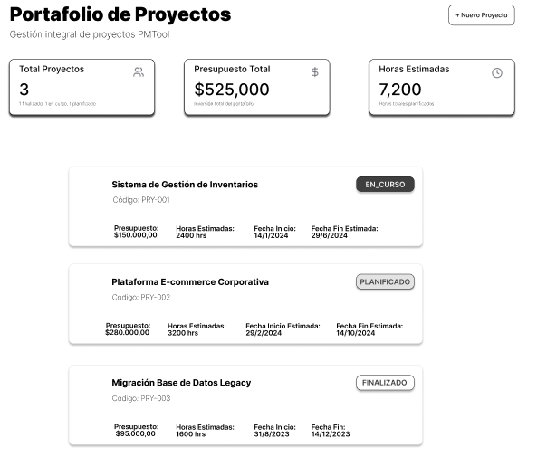
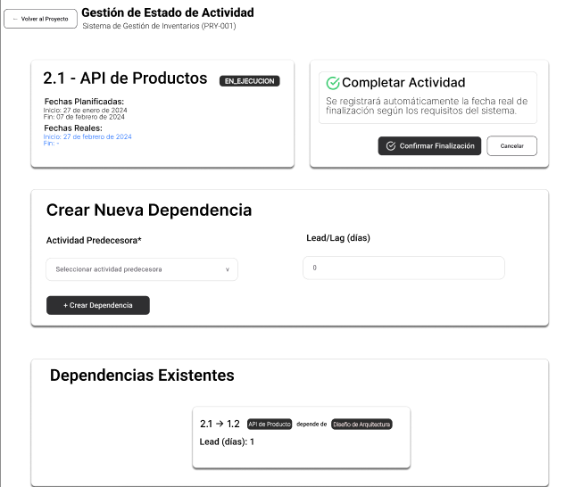

# Documentación de Decisiones de Diseño UI - PMTool

*Haz click **[Aquí](https://www.figma.com/proto/hFTAmDw03fC3X70Vi29zVv/PMTool?node-id=4-5388&p=f&t=Ji59y6wYZXWxla7R-1&scaling=min-zoom&content-scaling=fixed&page-id=0%3A1&starting-point-node-id=4%3A5388)*** para ir al prototipo navegable

## **1. Arquitectura de Información**

### **Flujo de Usuario**

- **Decisión**: Flujo lineal Login → Portafolio → Funcionalidades específicas:
    - Portafolio → Crear Proyecto
    - Portafolio → ver estructura EDT → Funcionalidades específicas:
        - ver estructura EDT → Crear Actividad
        - ver estructura EDT → ver Actividad → Funcionalidades específicas:
            - ver Actividad → Crear Dependencia
- **Justificación**: Refleja el proceso natural de trabajo: autenticación → vista general → tareas específicas
- **Coherencia**: Alineado con las historias de dominio (ddd-001, ddd-002, ddd-003)

## **2. Sistema de Diseño Visual**

### **Paleta de Colores**

- **Azul**: Funcionalidades principales (botones primarios, estados activos)
- **Verde**: Elementos completados, confirmaciones, registro
- **Gris**: Estados neutros, información secundaria
- **Justificación**: Colores intuitivos que comunican estado y jerarquía sin necesidad de explicación

### **Tipografía y Jerarquía**

- **Decisión**: Títulos grandes (3xl) para páginas principales, subtítulos medianos (xl) para secciones
- **Justificación**: Establece clara jerarquía visual que guía la atención del usuario
- **Consistencia**: Mismo patrón en todas las interfaces

## **3. Componentes de Interfaz**

### **Cards como Contenedores Principales**

- **Decisión**: Uso extensivo de Cards para agrupar información relacionada
- **Justificación**:
    - Separa visualmente diferentes tipos de contenido
    - Facilita el escaneo rápido de información
    - Coherente con patrones modernos de UI
    - **Aplicación**: Proyectos, actividades, dependencias, formularios

### **Estados Visuales Diferenciados**

- **Decisión**: Iconos + colores + tags para estados de proyectos/actividades
- **Justificación**:
    - Comunicación visual inmediata del estado
    - Accesible para usuarios con diferentes capacidades
    - Reduce carga cognitiva

## **4. Formularios y Entrada de Datos**

### **Datos Pre-poblados**

- **Decisión**: Formularios con datos de ejemplo realistas
- **Justificación**:
    - Facilita la comprensión del prototipo
    - Muestra el tipo de datos esperados
    - Acelera las pruebas de concepto

## **5. Gestión de Información Compleja**

### **Jerarquía EDT Expandible**

- **Decisión**: Estructura de árbol
- **Justificación**:
    - Maneja eficientemente la complejidad jerárquica (Req. 1.2)
    - Permite vista general y detalle según necesidad
    - Escalable para proyectos grandes

### **Tablas de Información Densa**

- **Decisión**: Combinación de texto, tags e iconos
- **Justificación**:
    - Maximiza información visible sin saturar
    - Diferentes tipos de datos requieren diferentes representaciones
    - Facilita comparación rápida entre elementos

## **6. Accesibilidad y Usabilidad**

### **Contraste y Legibilidad**

- **Decisión**: Alto contraste entre texto y fondo, tamaños de fuente legibles
- **Justificación**: Accesible para usuarios con diferentes capacidades visuales

### **Etiquetas Descriptivas**

- **Decisión**: Etiquetas claras, placeholders informativos, tooltips explicativos
- **Justificación**: Reduce curva de aprendizaje y errores de usuario

## **7. Coherencia con el Dominio**

### **Terminología Específica**

- **Decisión**: Uso consistente de términos del dominio (EDT, Gerente de Portafolio, etc.)
- **Justificación**: Alineado con el vocabulario del negocio y requisitos

### **Flujos de Trabajo Reales**

- **Decisión**: Interfaces que reflejan procesos reales de gestión de proyectos
- **Justificación**: Facilita adopción por usuarios familiarizados con metodologías PM
