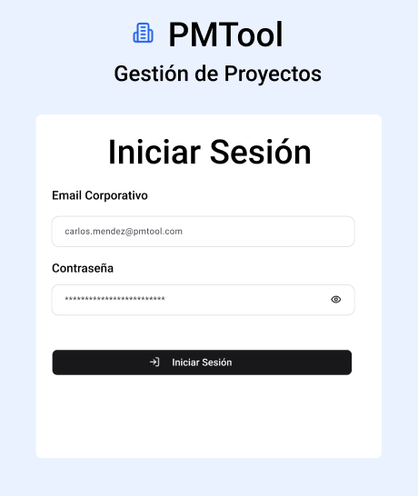
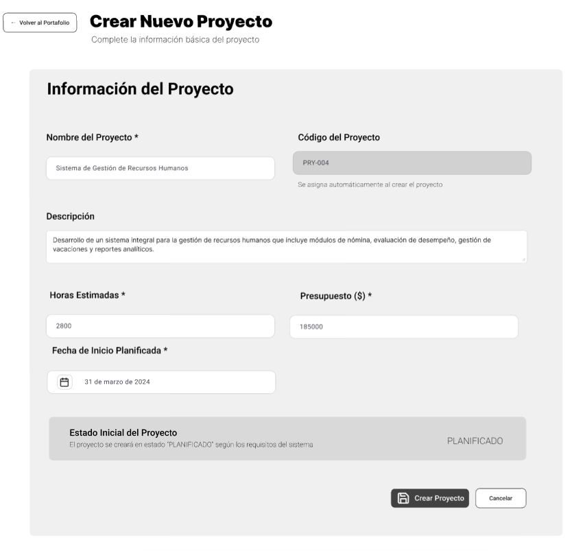
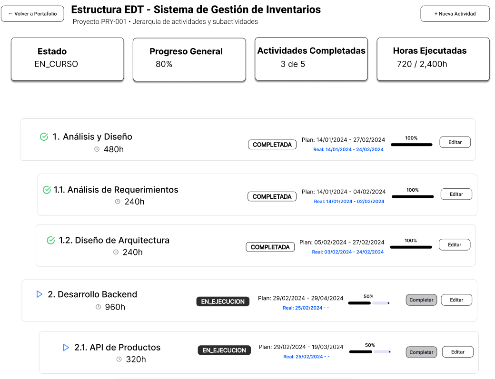

# Documentación de Decisiones de Diseño UI - PMTool

## **1. Arquitectura de Información**

### **Flujo de Usuario**

- **Decisión**: Flujo lineal Login → Dashboard → Funcionalidades específicas
- **Justificación**: Refleja el proceso natural de trabajo: autenticación → vista general → tareas específicas
- **Coherencia**: Alineado con las historias de dominio (ddd-001, ddd-002, ddd-003)

## **2. Sistema de Diseño Visual**

### **Paleta de Colores**

- **Azul**: Funcionalidades principales (botones primarios, estados activos)
- **Verde**: Elementos completados, confirmaciones, registro
- **Gris**: Estados neutros, información secundaria
- **Rojo**: Errores, validaciones, acciones destructivas
- **Justificación**: Colores intuitivos que comunican estado y jerarquía sin necesidad de explicación

### **Tipografía y Jerarquía**

- **Decisión**: Títulos grandes (3xl) para páginas principales, subtítulos medianos (xl) para secciones
- **Justificación**: Establece clara jerarquía visual que guía la atención del usuario
- **Consistencia**: Mismo patrón en todas las interfaces

## **3. Componentes de Interfaz**

### **Cards como Contenedores Principales**

- **Decisión**: Uso extensivo de Cards para agrupar información relacionada
- **Justificación**:

- Separa visualmente diferentes tipos de contenido
- Facilita el escaneo rápido de información
- Coherente con patrones modernos de UI
- **Aplicación**: Proyectos, actividades, dependencias, formularios

### **Estados Visuales Diferenciados**

- **Decisión**: Iconos + colores + badges para estados de proyectos/actividades
- **Justificación**:

- Comunicación visual inmediata del estado
- Accesible para usuarios con diferentes capacidades
- Reduce carga cognitiva

## **4. Formularios y Entrada de Datos**

### **Datos Pre-poblados**

- **Decisión**: Formularios con datos de ejemplo realistas
- **Justificación**:

- Facilita la comprensión del prototipo
- Muestra el tipo de datos esperados
- Acelera las pruebas de concepto
- **Ejemplos**: "Sistema de Gestión de RRHH", emails corporativos, fechas realistas

## **5. Gestión de Información Compleja**

### **Jerarquía EDT Expandible**

- **Decisión**: Estructura de árbol
- **Justificación**:

- Maneja eficientemente la complejidad jerárquica (Req. 1.2)
- Permite vista general y detalle según necesidad
- Escalable para proyectos grandes

### **Tablas de Información Densa**

- **Decisión**: Combinación de texto, badges, progress bars e iconos
- **Justificación**:

- Maximiza información visible sin saturar
- Diferentes tipos de datos requieren diferentes representaciones
- Facilita comparación rápida entre elementos

## **6. Feedback y Estados de Carga**

### **Indicadores de Progreso**

- **Decisión**: Progress bars para proyectos/actividades
- **Justificación**:
- Comunica claramente el estado actual

## **7. Accesibilidad y Usabilidad**

### **Contraste y Legibilidad**

- **Decisión**: Alto contraste entre texto y fondo, tamaños de fuente legibles
- **Justificación**: Accesible para usuarios con diferentes capacidades visuales

### **Etiquetas Descriptivas**

- **Decisión**: Labels claros, placeholders informativos, tooltips explicativos
- **Justificación**: Reduce curva de aprendizaje y errores de usuario

## **8. Coherencia con el Dominio**

### **Terminología Específica**

- **Decisión**: Uso consistente de términos del dominio (EDT, Gerente de Portafolio, etc.)
- **Justificación**: Alineado con el vocabulario del negocio y requisitos

### **Flujos de Trabajo Reales**

- **Decisión**: Interfaces que reflejan procesos reales de gestión de proyectos
- **Justificación**: Facilita adopción por usuarios familiarizados con metodologías PM

Enlace al prototipo navegable: https://www.figma.com/design/hFTAmDw03fC3X70Vi29zVv/PMTool?node-id=0-1&t=Z6ISqfCP4raBgn2x-1

(Quiero aclarar que estoy teniendo problemas con el modo presentacion, hay elementos que ESTAN creados, pero por algun motivo no se muestran. Por eso paso fotos a modo de prueba)